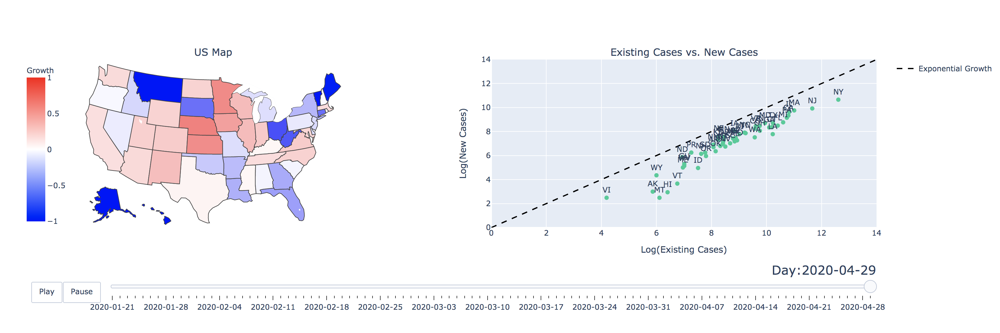

## Introduction

Source Code from [Data Visualization of COVID-19 in the US: Have we turned the Corner?](https://towardsdatascience.com/data-visualization-of-covid-19-in-the-us-1881938aaf17)

Photo by Yassine Khalfalli on Unsplash

## File Structure

    
    '''
    ├── README.md
    ├── imgs
    │   ├── cover.jpg
    │   ├── readme_imgs
    │   │   ├── Coronavirus-COVID-19-1.jpg
    │   │   ├── countriesDeath.png
    │   │   ├── countriesGrowth.png
    │   │   ├── countriesGrowthZoom.png
    │   │   ├── statesDeath.png
    │   │   └── statesGrowth.png
    │   └── scatterMap.png
    ├── notebooks
    │   ├── Continents\ EX.ipynb
    │   ├── DR_EDA.ipynb
    │   ├── EDA\ notebook.ipynb
    │   └── Untitled.ipynb
    └── src
        ├── AllStatesAnalysis_Static.py
        ├── AnimatedBase.py
        ├── AnimatedScatterMap.py
        ├── World_Coronavirus_Analysis.py
        ├── __pycache__
        │   └── AnimatedBase.cpython-37.pyc
        └── exponential.py
    '''

  Data is stored locally

## Next Steps

1. Improved data pipeline
2. Build a model

